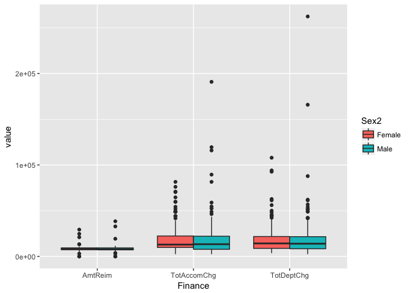
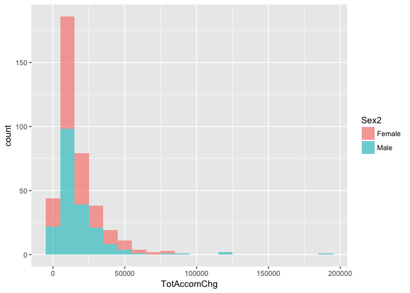
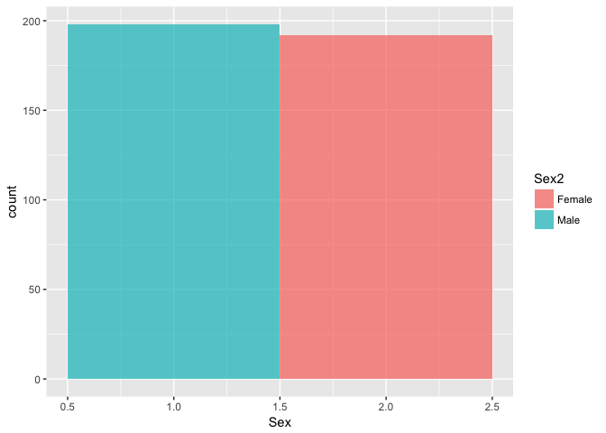
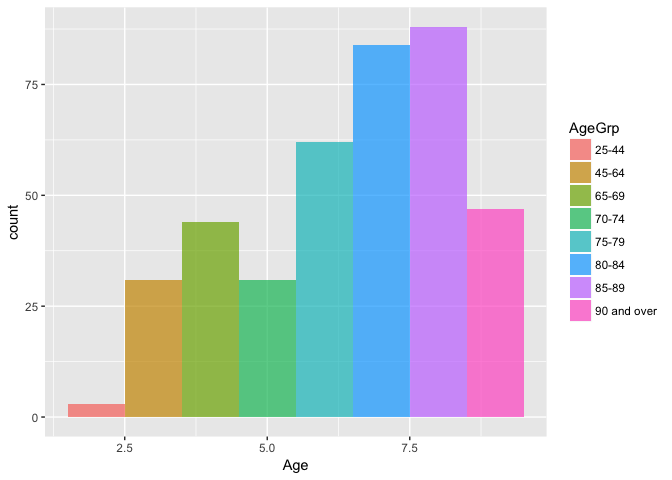
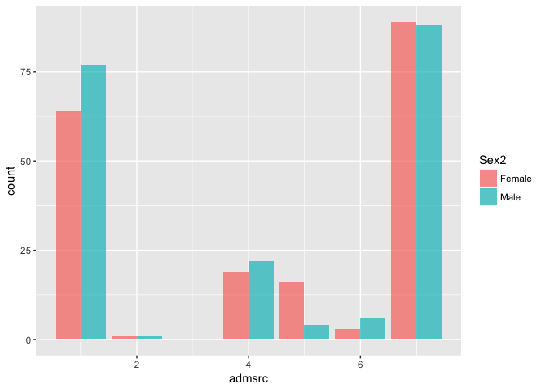

# LiveSessionAssignment09-Medicare Admissions
Peter Byrd  
November 11, 2016  

# Exploratory Data Analysis of Medicare Admissions

## Introduction

This analysis pulls data from the MedPAR dataset that is distributed by CMS, the entity that administers the Medicare program.  The dataset contains inpatient Medicare admissions.  

## Load data
First we must install packages and load the appropriate data from our data source.


```r
## Set the working directory and load packages
setwd("/Users/pbyrd/Git/LiveSessionAssignment09")

## Need to install the following packages: ggplot2 and plotly
library('ggplot2')
library('plotly')
```

```
## 
## Attaching package: 'plotly'
```

```
## The following object is masked from 'package:ggplot2':
## 
##     last_plot
```

```
## The following object is masked from 'package:stats':
## 
##     filter
```

```
## The following object is masked from 'package:graphics':
## 
##     layout
```

```r
library('reshape2')

## Read CSV input file
chf <- read.csv("Data/CHF.csv", header=TRUE)
```

## Clean and Merge the data

The data is relatively clean, but we need to add a few variables and rename a few variables to make the analysis easier.  This will create our final clean dataset.


```r
# clean and categorize 
chf[chf$Age == 1, "AgeGrp"] = "less than 25"
chf[chf$Age == 2, "AgeGrp"] = "25-44"
chf[chf$Age == 3, "AgeGrp"] = "45-64"
chf[chf$Age == 4, "AgeGrp"] = "65-69"
chf[chf$Age == 5, "AgeGrp"] = "70-74"
chf[chf$Age == 6, "AgeGrp"] = "75-79"
chf[chf$Age == 7, "AgeGrp"] = "80-84"
chf[chf$Age == 8, "AgeGrp"] = "85-89"
chf[chf$Age == 9, "AgeGrp"] = "90 and over"

chf[chf$Sex == 1, "Sex2"] = 'Male'
chf[chf$Sex == 2, "Sex2"] = "Female"

chf[chf$dischdest == 20, "Expired"] = 1
chf[chf$dischdest != 20, "Expired"] = 0

chf$Sex2 <- factor(chf$Sex2)
chf$AgeGrp <- factor(chf$AgeGrp)
chf$drgcode <- factor(chf$drgcode)
```

## Analyze the data

Now that we have a clean dataset, we want to run some analysis on the data.  

### Mean for Amount Paid by Medicare, Total Accommodations Charges, and Total Departmental Charges


```r
# mean amount paid by medicare, total accomodation charges, and total department charges
mean.amtreim <- format(mean(chf$AmtReim), big.mark=",",big.interval=3,digits=2,nsmall=2)
mean.amtreim
```

```
## [1] "8,324.90"
```

```r
mean.TotAccomChg <- format(mean(chf$TotAccomChg), big.mark=",",big.interval=3,digits=2,nsmall=2)
mean.TotAccomChg
```

```
## [1] "18,675.75"
```

```r
mean.TotDeptChg <- format(mean(chf$TotDeptChg), big.mark=",",big.interval=3,digits=2,nsmall=2)
mean.TotDeptChg
```

```
## [1] "18,729.44"
```

The mean values for each variable are listed here:
  Mean Amount Paid by Medicare:     $ 8,324.90
  Mean Total Accomodation Charges:  $18,675.75
  Mean Total Department Charges:    $18,729.44

### Standard deviation for Amount Paid by Medicare, Total Accomodation Charges, and Total Departmental Charges


```r
# standard deviation 
std.amtreim <- format(sd(chf$AmtReim), big.mark=",",big.interval=3,digits=2,nsmall=2)
std.amtreim
```

```
## [1] "3,164.95"
```

```r
std.TotAccomChg <- format(sd(chf$TotAccomChg),big.mark=",",big.interval=3,digits=2,nsmall=2)
std.TotAccomChg
```

```
## [1] "17,922.97"
```

```r
std.TotDeptChg <- format(sd(chf$TotDeptChg),big.mark=",",big.interval=3,digits=2,nsmall=2)
std.TotDeptChg
```

```
## [1] "20,102.60"
```

The standard deviations for each variable are listed here:
  Standard Deviation of Amount Paid by Medicare:    $ 3,164.95
  Standard Deviation of Total Accomodation Charges: $17,922.97
  Standard Deviation of Total Department Charges:   $20,102.60

### Use tapply() to calculate mean for Amount Paid by Medicare, Total Accomodataion Charges, adn Total Department Charges, by Gender


```r
# use tapply()
meanbysex.amtreim <- format(tapply(chf$AmtReim,chf$Sex2,mean),big.mark=",",big.interval=3,digits=2,nsmall=2)
meanbysex.amtreim
```

```
##     Female       Male 
## "8,439.62" "8,213.66"
```

```r
meanbysex.TotAccomChg <- format(tapply(chf$TotAccomChg,chf$Sex2,mean),big.mark=",",big.interval=3,digits=2,nsmall=2)
meanbysex.TotAccomChg
```

```
##      Female        Male 
## "18,625.29" "18,724.69"
```

```r
meanbysex.TotDeptChg <- format(tapply(chf$TotDeptChg,chf$Sex2,mean),big.mark=",",big.interval=3,digits=2,nsmall=2)
meanbysex.TotDeptChg
```

```
##      Female        Male 
## "18,007.78" "19,429.24"
```

The mean value by gender for each variable is listed here:
  Mean by Gender of Amount Paid by Medicare:    Male   - $ 8,213.66
                                                Female - $ 8,439.62
  Mean by Gender of Total Accomodation Charges: Male   - $18,724.69
                                                Female - $18,625.29
  Mean by Gender of Total Department Charges:   Male   - $19,429.24
                                                Female - $18,007.78

### Create a boxplot for Amount Paid by Medicare, Total Accomodation Charges, and Total Departmental Charges by gender


```r
# boxplot
chf.m <- melt(chf,measure=c("AmtReim","TotAccomChg","TotDeptChg"),variable.name="Finance")
ggplot(chf.m,aes(Finance,value)) +geom_boxplot(aes(fill=Sex2))
```

<!-- -->

We can see from the boxplot that the amount reimbursed was significantly less than the Total Accomodation Charges and the Total Department Charges.  There are significant outliers for Total Accomodation Charges and Total Department Charges, and particulary for males.

### Create a histogram for Total Accomodation Charges, Gender, and Age Category, and describe what you see for each


```r
# histogram
ggplot(chf,aes(TotAccomChg,fill=Sex2)) +geom_histogram(binwidth=10000,alpha=.6)
```

<!-- -->

```r
ggplot(chf,aes(Sex,fill=Sex2)) +geom_histogram(binwidth=1,alpha=.7)
```

<!-- -->

```r
ggplot(chf,aes(Age,fill=AgeGrp)) +geom_histogram(binwidth=1,alpha=.7)
```

<!-- -->

From the histogram of Total Accomodation Charges, we can see that the majority of accomodation charges were around $15-20k, but there is a long tail to the right showing that there were instances of accomodation charges between the range of $100-200k.

From the histogram of Gender, we can see that slightly more males than females were admitted.

From the histogram of Age Category, we can see that the age group from 85-89 had the highest number of admissions, followed by the age group from 80-84.  Overall the histogram is heavy to the right, meaning there were more admissions for older age groups.

### Count of Gender for each admission source


```r
# bar plot of gender count by admission source
ggplot(chf,aes(admsrc,fill=Sex2)) +geom_bar(alpha=.7,position="dodge")
```

<!-- -->

From the bar plot, we see that admission source 7 (Emergency room) was the highest source of admission for both men and women, followed by admission source 1 (Physician referral) which had a slightly higher number for men than women.

### Mortality rate for MS-DRG 292 and MS-DRG 293


```r
# bar plot of mortality rate for MS-DRG 292 and MS-DRG 293
mortrate292 <- subset(chf,drgcode==292, select=c(drgcode,Expired))
mortrate293 <- subset(chf,drgcode==293, select=c(drgcode,Expired))

m292 <- nrow(mortrate292[mortrate292$Expired==1,])/nrow(mortrate292)
m293 <- nrow(mortrate293[mortrate293$Expired==1,])/nrow(mortrate293)

x <- c('MS-DRG 292','MS-DRG 293')
y <- c(m292, m293)
data <- data.frame(x,y)

plot_ly(data, x=x, y=y, type='bar') %>% layout(title="Mortality Rate")
```

<!--html_preserve--><div id="htmlwidget-f419e1c8283cacddef67" style="width:672px;height:480px;" class="plotly html-widget"></div>
<script type="application/json" data-for="htmlwidget-f419e1c8283cacddef67">{"x":{"layout":{"margin":{"b":40,"l":60,"t":25,"r":10},"title":"Mortality Rate","xaxis":{"domain":[0,1],"type":"category","categoryorder":"array","categoryarray":["MS-DRG 292","MS-DRG 293"]},"yaxis":{"domain":[0,1]}},"config":{"modeBarButtonsToRemove":["sendDataToCloud"]},"base_url":"https://plot.ly","source":"A","data":[{"x":["MS-DRG 292","MS-DRG 293"],"y":[0.0208333333333333,0.0246913580246914],"type":"bar","marker":{"fillcolor":"rgba(31,119,180,1)","color":"rgba(31,119,180,1)","line":{"color":"transparent"}},"xaxis":"x","yaxis":"y"}]},"evals":[],"jsHooks":[]}</script><!--/html_preserve-->

From the bar plot, we see that the mortality rate for MS-DRG 293 (.0247) is slightly higher than the mortality rate for MS-DRG 292 (.0208).

### T-test for the average length of stay for patients with MS-DRG 291 compared to the national average of 6 days

Ho: LOS for MS-DRG 291 = 6 days
Ha: LOS for MS-DRG 291 <> 6 days


```r
# test LOS for patients with MS-DRG 291 versus national average of 6 days
#     Ho: MS-DRG 291 LOS = 6 days
#     Ha: MS-DRG 291 LOS <> 6 days
t.test(subset(chf,drgcode==291,select=LOS),alternative="two.sided",mu=6,conf.level=0.95)
```

```
## 
## 	One Sample t-test
## 
## data:  subset(chf, drgcode == 291, select = LOS)
## t = 5.2706, df = 164, p-value = 4.233e-07
## alternative hypothesis: true mean is not equal to 6
## 95 percent confidence interval:
##  7.769979 9.890627
## sample estimates:
## mean of x 
##  8.830303
```

Using a 95% significance level results in a p-value of 0.0000004233; therefore, we reject the null hypotheis that the average length of stay for MS-DRG 291 patients is 6 days.  Instead, we accept the alternative hypothesis that the average length of stay for MS-DRG 291 patients is not equal to 6 days.

# End of Assignment
